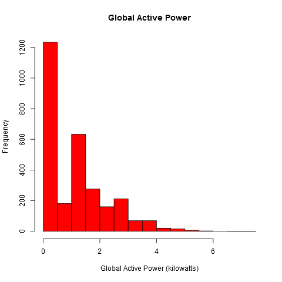
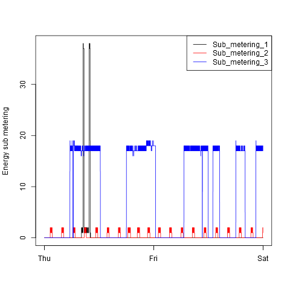
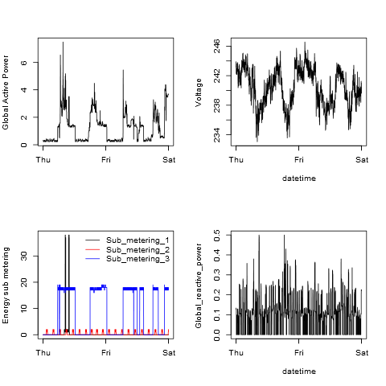

## About this assignment

 Our goal has been examine how household energy usage varies over the period [2007-02-01, 2007-02-02], 
 by the reconstruction of the four plots given with this assignment instructions and using the base plotting system.
 
### Assumptions
 
    1. The dataset "Electric power consumption" has been downloaded to the active working directory and 
    has been saved as "household_power_consumption.txt".
    
    2. Packages lubridate and chron have been installed.

### Notes
    1. We have been required to reconstruct Plots 1,2,3 and 4 save them to PNG files with a width of 480 
    pixels and a height of 480 pixels.
    
    2. The dimensions of the PNG files provided as example are width=504 pixels and height=504 pixels.
    
    3. These 32-bits depth example files have a transparent background that some PNG viewers render 
    as black.

## Plots reconstructed
   The following four plots (plot1.png, plot2.png, plot3.png and plot4.png) have been produced by the scripts stored in this repository (plot1.R, plot2.R, plot3.R, plot4.R).
   
### Plot 1 (plot1.R)

 

### Plot 2 (plot2.R)

 

### Plot 3 (plot3.R)

 

### Plot 4 (plot4.R)

 

